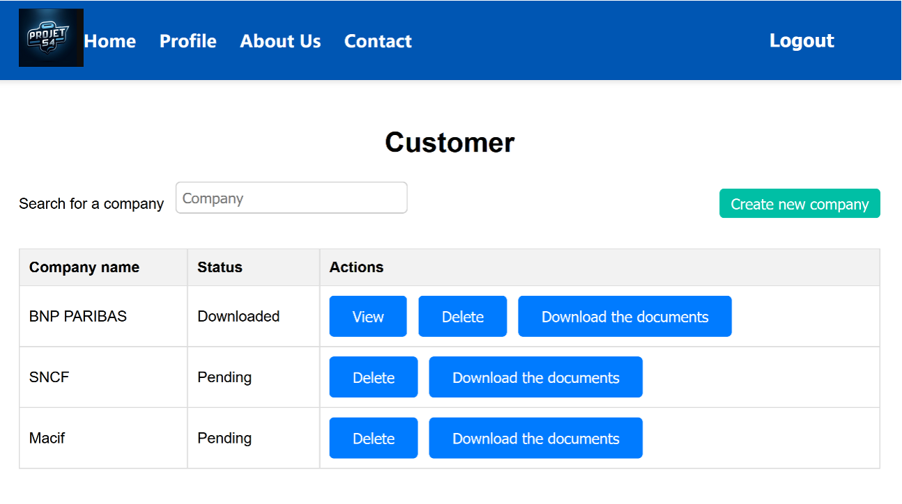

# Company Analysis Web Application

## Description

This is a web application designed for managing company data and document uploads. Users can view company details, upload documents, and perform various management tasks. The application is built with Django for the backend and React for the frontend.

## Features

- **Company Management**: Create, view, and delete company records.
- **Document Upload**: Upload and manage documents related to companies.
- **Analysis View**: View detailed analysis of companies.
- **Document Status**: Check and update the status of uploaded documents.
- **User Authentication**: Register, login, and manage users with authentication tokens.

## Technologies Used

- **Backend**: Django, Django REST Framework
- **Frontend**: React
- **Database**: SQLite (default; can be configured for other databases)
- **Authentication**: Token-based authentication using Django REST Framework

## Installation

### Prerequisites

- Python 3.x
- Node.js and npm
- Django
- Django REST Framework

### Backend Setup

1. **Clone the repository**:
    ```bash
    git clone https://github.com/yourusername/your-repository.git
    cd your-repository
    ```

2. **Set up a virtual environment**:
    ```bash
    python -m venv venv
    source venv/bin/activate  # On Windows use `venv\Scripts\activate`
    ```

3. **Install Django and other dependencies**:
    ```bash
    pip install -r requirements.txt
    ```

4. **Apply database migrations**:
    ```bash
    python manage.py migrate
    ```

5. **Create a superuser (optional)**:
    ```bash
    python manage.py createsuperuser
    ```

6. **Run the development server**:
    ```bash
    python manage.py runserver
    ```

### Frontend Setup

1. **Navigate to the frontend directory**:
    ```bash
    cd frontend
    ```

2. **Install npm dependencies**:
    ```bash
    npm install
    ```

3. **Start the React development server**:
    ```bash
    npm start
    ```

## API Endpoints

### Authentication

- `POST /api/login/` - Login and obtain an authentication token.
- `POST /api/register/` - Register a new user.

### Companies

- `GET /api/companies/` - List all companies.
- `POST /api/create-company/` - Create a new company.
- `GET /api/companies/<company_id>/` - Retrieve company details.
- `DELETE /api/companies/<company_id>/delete/` - Delete a company.

### Documents

- `POST /api/companies/upload-document/` - Upload a document for a company.
- `GET /api/companies/<company_id>/document-status/` - Get the status of a document for a company.

## Frontend Pages

- **Home**: Displays a list of companies with options to create new companies, view details, or delete.
- **Documents**: Allows users to upload documents for a selected company.
- **Analysis**: Displays detailed information and analysis of a selected company.
- 
## Screenshots

### Login Page


### Admin Page


### Create an account


### Customer View


### Document Submission


### New Company Form


### Request Page


### Analysis Page


## License

This project is licensed under the MIT License - see the [LICENSE](LICENSE) file for details.

---

Thank you for using the Company Analysis Web Application!
